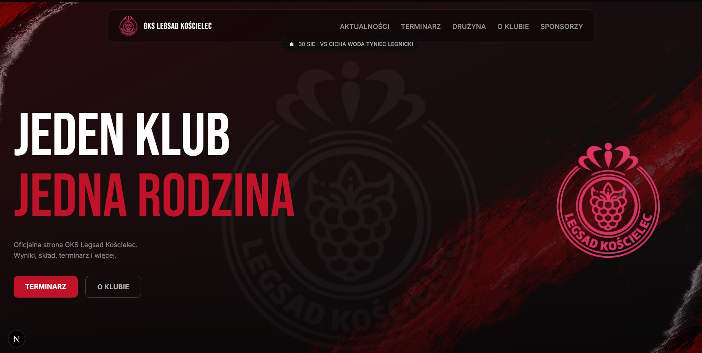
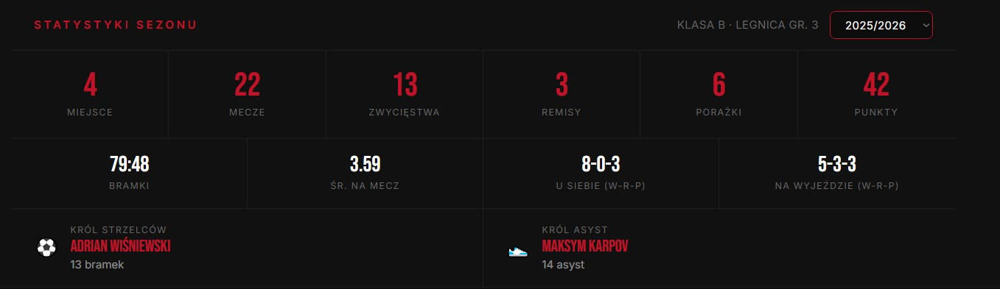
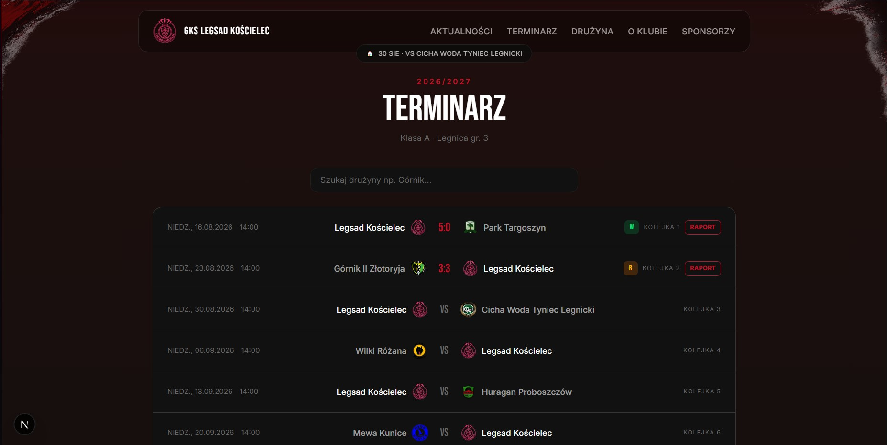
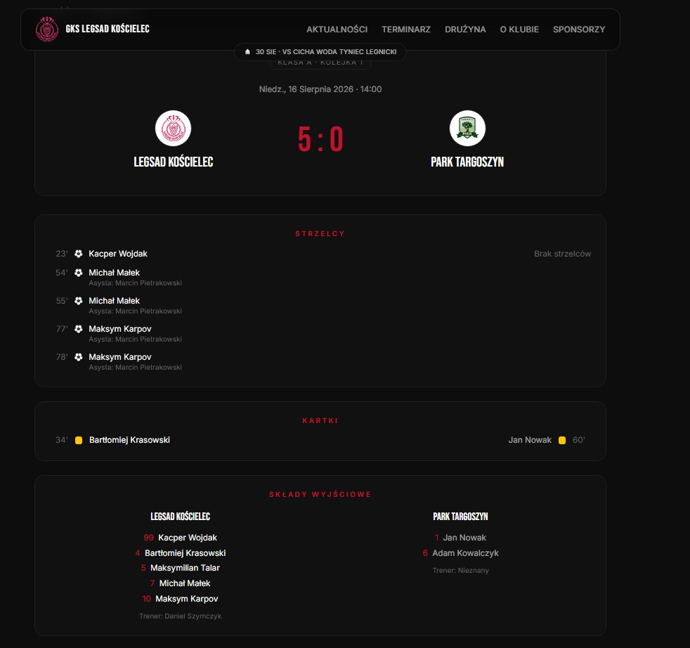
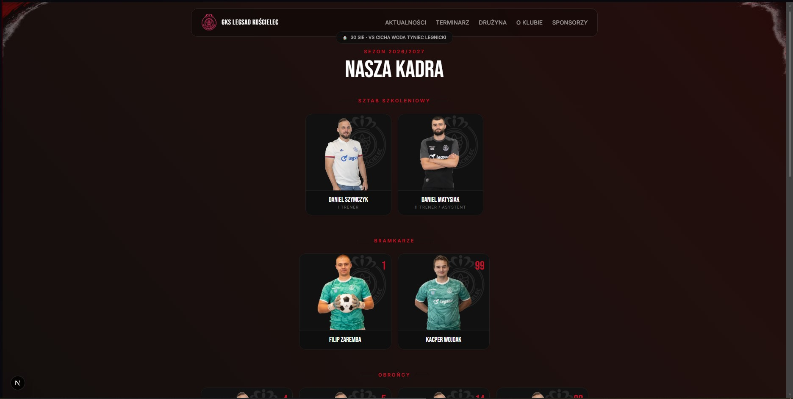
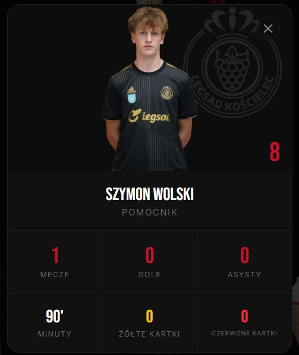
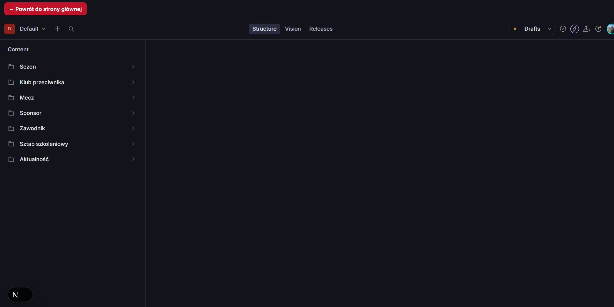
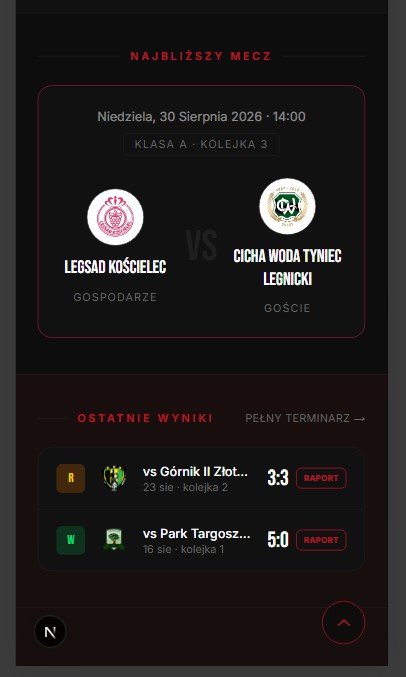
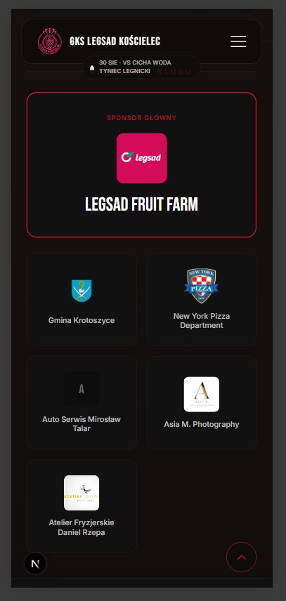

# GKS Legsad Kościelec — oficjalna strona klubu

Oficjalna strona internetowa GKS Legsad Kościelec — klubu piłkarskiego grającego obecnie w Klasie A (Okręg Legnicki, gr. 3). Projekt w pełni od podstaw: od statycznego makietowania po headless CMS z automatyczną rewalidacją treści.



---

## 🎯 O projekcie

Strona łączy dwie role: **informacyjną** (wyniki, terminarz, składy, statystyki na żywo) i **promocyjną** (prezentacja klubu dla sponsorów i potencjalnych zawodników). Całość zaprojektowana i zaimplementowana samodzielnie — od pierwszego makietowania w Tailwindzie, przez projekt schematów danych, aż po pełną migrację na Sanity CMS z webhookami rewalidującymi treść w czasie rzeczywistym.

Kluczowe założenie projektowe: **kierownik klubu ma samodzielnie zarządzać całą treścią** (wyniki, składy, aktualności, sponsorzy) bez znajomości kodu, przez prosty panel CMS.

---

## 📸 Zrzuty ekranu

<table>
<tr>
<td width="50%">

**Strona główna — Hero**


</td>
<td width="50%">

**Statystyki sezonu (dane liczone automatycznie)**


</td>
</tr>
<tr>
<td width="50%">

**Terminarz z wyszukiwarką**


</td>
<td width="50%">

**Raport meczowy**


</td>
</tr>
<tr>
<td width="50%">

**Skład drużyny**


</td>
<td width="50%">

**Modal zawodnika ze statystykami**


</td>
</tr>
<tr>
<td width="50%">

**Panel Sanity Studio (CMS)**


</td>
<td width="50%">

**Widok mobilny**
<p align="center">


</p>

</td>
</tr>
</table>

---

## ✨ Funkcjonalności

- **Statystyki sezonu liczone automatycznie** — gole, asysty, minuty, kartki i klasyfikacja króla strzelców/asyst wyliczane na żywo na podstawie raportów meczowych, z pełną obsługą remisów (ex aequo) i poprawną polską odmianą liczebników
- **Szczegółowe raporty meczowe** — strzelcy z asystentami, żółte/czerwone kartki (w tym wizualne oznaczenie czerwonej z dwóch żółtych, jak na Flashscore), składy wyjściowe, ławka rezerwowych, zmiany zawodników z minutą wejścia/zejścia
- **Precyzyjne liczenie minut gry** — uwzględnia zmiany oraz czerwone kartki (zawodnik z czerwoną w 24' ma policzone tylko 24 minuty, nie 90)
- **Interaktywne karty zawodników** — kliknięcie nazwiska (w składzie, raporcie czy na liście drużyny) otwiera modal z pełnymi statystykami sezonowymi tego zawodnika
- **Terminarz z wyszukiwarką** — filtrowanie meczów po nazwie drużyny w czasie rzeczywistym
- **Wybór sezonu** — przełączanie między sezonami z osobną logiką dla sezonu bieżącego (dane liczone automatycznie) i historycznego (dane archiwalne wpisane ręcznie)
- **Aktualności z rich-textem** — pełny edytor Portable Text w CMS, obsługa zdjęć w treści artykułu
- **Automatyczna rewalidacja treści** — webhook Sanity → Next.js API Route → natychmiastowe odświeżenie stron po publikacji zmian w CMS
- **Płynne animacje** — kaskadowe fade-in przy scrollu (Motion/Framer Motion), animowane wejście/wyjście modali
- **W pełni responsywne** — dedykowane layouty mobile dla list statystyk meczowych (chronologiczna lista z etykietą drużyny zamiast układu dwukolumnowego)
- **SEO i Open Graph** — dynamiczna metadata dla każdej podstrony, wygenerowany sitemap.xml, skonfigurowany robots.txt

---

## 🛠️ Stack technologiczny

| Warstwa | Technologia |
|---|---|
| Framework | Next.js 15 (App Router, Server Components) |
| Język | TypeScript |
| Stylowanie | Tailwind CSS v4 |
| Animacje | Motion (Framer Motion) |
| CMS | Sanity (headless, embedded Studio) |
| Zapytania danych | GROQ |
| Rich text | Portable Text |
| Hosting | Netlify |
| Wersjonowanie | Git / GitHub |

---

## 🏗️ Architektura

**Wzorzec Server/Client Components** — strony pobierają dane z Sanity po stronie serwera (Server Components), a interaktywność (wyszukiwarki, modale, dropdowny) jest wydzielona do osobnych Client Components, które dostają gotowe dane jako propsy. Dzięki temu żadne zapytanie do CMS-a nie odbywa się po stronie przeglądarki.

**Logika biznesowa oddzielona od widoku** — cała matematyka statystyk (agregacja goli, asyst, minut z uwzględnieniem zmian i kartek, wyłanianie króla strzelców z obsługą remisów) żyje w `lib/stats.ts` jako czyste funkcje, niezależne od źródła danych czy warstwy prezentacji.

**Content model w Sanity** — siedem powiązanych ze sobą typów dokumentów (`season`, `match`, `club`, `player`, `staff`, `sponsor`, `news`), z referencjami między nimi (np. mecz odwołuje się do sezonu i klubu przeciwnika przez `reference`, nie przez zdublowany tekst).

**Rewalidacja on-demand** — zamiast czekać na czasowe odświeżenie cache, Sanity wysyła webhook przy każdej publikacji, który trafia do dedykowanego API Route (`/api/revalidate`) i natychmiast czyści cache konkretnych, dotkniętych zmianą stron.

---

## 📁 Struktura projektu

```
legsad/
├── app/
│   ├── components/        # Współdzielone komponenty (Navbar, Footer, PlayerModal...)
│   ├── mecz/[id]/          # Raport meczowy
│   ├── terminarz/          # Terminarz z wyszukiwarką
│   ├── druzyna/             # Skład drużyny
│   ├── aktualnosci/         # Lista i szczegóły newsów
│   ├── o-klubie/            # Informacje o klubie
│   ├── api/revalidate/      # Endpoint webhooka Sanity
│   ├── sitemap.ts
│   └── robots.ts
├── lib/
│   ├── stats.ts             # Logika liczenia statystyk zawodników i sezonu
│   ├── queries.ts           # Zapytania GROQ do Sanity
│   └── sanity.ts            # Konfiguracja klienta Sanity
├── sanity/
│   └── schemaTypes/         # Schematy dokumentów CMS
└── public/                  # Statyczne zasoby (logo, efekty graficzne)
```

---

## 🗺️ Status projektu

**Gotowe:**
- Pełna migracja na Sanity CMS (wszystkie dane dynamiczne)
- Kompletny system raportów meczowych z precyzyjnym liczeniem statystyk
- Responsywność, animacje, SEO
- Automatyczna rewalidacja treści przez webhooki

**W planach:**
- Referencje do zawodników w raportach meczowych (zamiast wolnego tekstu) — eliminacja literówek, dropdown w CMS
- Dynamicznie generowane obrazy Open Graph dla poszczególnych meczów
- Docelowa domena i migracja hostingu
